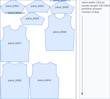

# Fattern

[한국어](README.md)

Current version: **0.9.0**

Fattern reads apparel DXF pattern files and estimates rough marker yield plus quotation yield.
The deterministic engine performs the calculation. Humans use the Web UI, and AI clients use MCP to run the same workflow.

```text
General users: run fattern -> upload DXF in the Web UI -> review preview and reports
AI users: run the calculation through MCP -> review the returned Web UI URL
```

Fattern is not a production-confirmed CAD nesting replacement. It is designed for quotes, sample review, and early fabric-use checks.

## What v0.9.0 Adds

- Running `fattern` opens the local Web UI.
- `input/`, `output/`, and `config/` are created automatically.
- Web UI, CLI, and MCP runs all save results under `output/run_id/`.
- Outputs are grouped as `result.json`, `marker_preview.svg`, `marker_report.md`, `marker_report.pdf`, `report.csv`, and `run_summary.txt`.
- `minimum_yield` and `quote_yield` are separated.
- The Web UI includes an Advisor that explains warnings and blockers in plain language.
- `fattern host` enables hosted Web UI and Remote MCP preparation endpoints.

## Install

Python 3.11 or newer is required.

```powershell
python -m pip install https://github.com/woooya129-ai/fattern/archive/refs/heads/main.zip
```

After PyPI release, installation can become:

```powershell
python -m pip install fattern
```

## Easiest Run

```powershell
fattern
```

When the browser opens, upload a DXF file and enter fabric width, unit, seam allowance status, grainline, and direction conditions.

The workspace folders look like this.

```text
fattern-workspace/
  input/
    Put DXF files here for folder-based workflows

  output/
    Calculation results are saved here

  config/
    Default answers.json
```

## Default Questionnaire

The Web UI and CLI start from these values. Leave unknown values as defaults and change only what you know.

```json
{
  "schema_version": "1.0",
  "fabric_width": 150,
  "unit": "cm",
  "size_ratio": {},
  "spacing": 0.2,
  "allowed_rotation": [0],
  "grainline_required": false,
  "nap_direction": "two_way",
  "shrinkage_percent": 0,
  "fabric_type": "unknown",
  "seam_allowance": {"status": "included"},
  "allowance_policy": {"mode": "fast_quote"}
}
```

Use `seam_allowance.status = included` when the pattern already includes seam allowance.
Use `excluded` when it does not. Without a custom fallback width, Fattern applies the default `1/2 inch` rough allowance.

## Reading Outputs

Each calculation creates a run folder.

```text
output/
  20260518-153012_Simple-T/
    marker_preview.svg
    marker_report.md
    marker_report.pdf
    report.csv
    result.json
    run_summary.txt
```

Files:

- `marker_preview.svg`: marker layout preview
- `marker_report.pdf`: shareable report
- `marker_report.md`: readable calculation report
- `report.csv`: spreadsheet and automation output
- `result.json`: full result for MCP, Codex, and Claude Code
- `run_summary.txt`: shortest summary

Example output:



Read the key numbers this way:

- `minimum_yield`: minimum length from the current deterministic layout
- `quote_yield`: estimated length intended for quotation
- `allowance_breakdown`: why extra allowance was added to `quote_yield`
- `confidence`: quote confidence based on inputs and warnings

## CLI

Advanced users can calculate directly from the CLI.

```powershell
fattern estimate input\sample.dxf --fabric-width 150 --unit cm --seam-allowance-status included --nap-direction two_way --grainline-required no
```

CLI results use the same run-folder layout as the Web UI.

## MCP

stdio server:

```powershell
fattern-mcp
```

or:

```powershell
fattern mcp-stdio
```

Use `estimate_workspace_dxf` first for DXF files already under the workspace. For attached files or remote-compatible flows, register the file with `register_input_file`, then call `calculate_marker_yield`.

High-level MCP results include:

- `run_id`
- `output_dir`
- `web_url`
- `preview_url`
- `report_url`

## Hosted Web UI and Remote MCP Prep

v0.9.0 includes a hosted-prep run mode.

```powershell
fattern host --host 127.0.0.1 --port 8765
```

This enables Remote MCP preparation endpoints on the same Web UI server.

- `/mcp`: HTTP JSON-RPC endpoint
- `/server.json`: draft future MCP registry/package manifest
- `/hosting/policy`: upload, retention, auth, and security policy JSON
- `/healthz`: health check

Public binds require a bearer token.

```powershell
$env:FATTERN_REMOTE_MCP_TOKEN = "change-me"
fattern host --host 0.0.0.0 --public-base-url https://example.com
```

The current `/mcp` endpoint is not a production OAuth connector. OAuth 2.1 protected-resource metadata, account/project isolation, retention jobs, and quota enforcement are still pending.

See [Hosted Web UI and Remote MCP](docs/hosting.md).

## Advisor

The Web UI Advisor works without an LLM.

- explains warning and blocker codes in plain language
- explains `cuttable_width`, `seam_allowance`, `nap_direction`, `grainline_required`, and `quote_yield`
- enables optional LLM Advisor only when a server-side API key exists

API keys are not exposed to the browser. The LLM receives a sanitized result summary, not the original full DXF.

## Scope

Currently supported:

- closed `LWPOLYLINE`
- R12 legacy `POLYLINE + VERTEX + SEQEND`
- simple connected `LINE` loop fallback
- rough marker layout
- separated `minimum_yield` and `quote_yield`
- Web UI, CLI, MCP
- hosted-prep Web UI + Remote MCP HTTP endpoint

Not yet supported:

- high-precision conversion for every DXF entity
- stripe/plaid matching
- fold pieces, mirrored pairs
- production-confirmed nesting
- plotter-ready multi-page PDF
- automatic seam allowance detection

## Development

```powershell
python -m unittest discover -s tests
```

## Docs

- [Developer guide](docs/developer.md)
- [AI client guide](docs/ai-clients.md)
- [Hosted Web UI and Remote MCP](docs/hosting.md)

## License

Source-available, noncommercial use only.

- [LICENSE](LICENSE)
- [COMMERCIAL-LICENSE.md](COMMERCIAL-LICENSE.md)
- [NOTICE](NOTICE)
