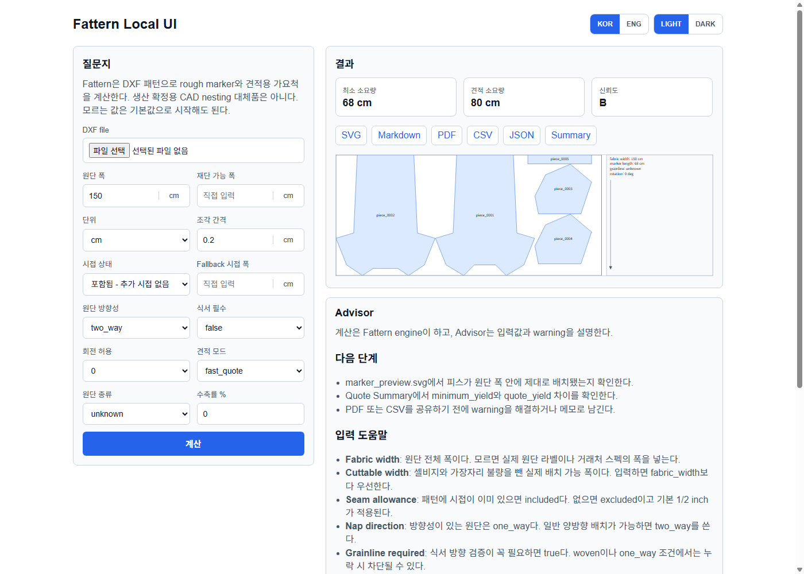

# Fattern

[English](README.en.md)

현재 버전: **0.9.0**

Fattern은 DXF 의류 패턴을 읽어서 rough marker와 견적용 가요척을 계산하는 도구다.
핵심 계산은 deterministic engine이 하고, 사람은 Web UI로, AI 클라이언트는 MCP로 같은 계산을 실행한다.

```text
일반 사용자: fattern 실행 -> Web UI에서 DXF 업로드 -> preview와 report 확인
AI 사용자: MCP로 계산 실행 -> Web UI URL로 결과 확인
```

생산 확정용 CAD nesting 대체품은 아니다. 견적, 샘플 검토, 사전 원단 소요량 확인에 맞춘 도구다.

## v0.9.0에서 정리된 것

- `fattern`만 실행하면 로컬 Web UI가 열린다.
- `input/`, `output/`, `config/` 폴더가 자동으로 만들어진다.
- Web UI, CLI, MCP 결과가 모두 `output/run_id/` 폴더에 저장된다.
- 결과 파일은 `result.json`, `marker_preview.svg`, `marker_report.md`, `marker_report.pdf`, `report.csv`, `run_summary.txt`로 정리된다.
- `minimum_yield`와 `quote_yield`를 분리했다.
- Web UI에 Advisor가 들어갔다. 경고와 blocker를 쉬운 말로 설명한다.
- `fattern host`로 hosted Web UI와 Remote MCP 준비용 endpoint를 켤 수 있다.

## 설치

Python 3.11 이상이 필요하다.

```powershell
python -m pip install https://github.com/woooya129-ai/fattern/archive/refs/heads/main.zip
```

PyPI 배포 후에는 아래처럼 설치할 수 있다.

```powershell
python -m pip install fattern
```

## 가장 쉬운 실행

```powershell
fattern
```

브라우저가 열리면 DXF 파일을 업로드하고 원단 폭, 단위, 시접 포함 여부, 식서/방향 조건을 입력하면 된다.

작업 폴더는 이렇게 잡힌다.

```text
fattern-workspace/
  input/
    DXF 파일을 직접 넣는 곳

  output/
    계산 결과가 저장되는 곳

  config/
    기본 answers.json
```

## 기본 질문지

Web UI와 CLI는 아래 값을 기준으로 계산을 시작한다. 모르는 값은 기본값으로 두고, 확실한 값만 바꾸면 된다.

```json
{
  "schema_version": "1.0",
  "fabric_width": 150,
  "unit": "cm",
  "size_ratio": {},
  "spacing": 0.2,
  "allowed_rotation": [0],
  "grainline_required": false,
  "nap_direction": "two_way",
  "shrinkage_percent": 0,
  "fabric_type": "unknown",
  "seam_allowance": {"status": "included"},
  "allowance_policy": {"mode": "fast_quote"}
}
```

시접이 패턴에 포함돼 있으면 `seam_allowance.status`는 `included`다.
시접이 없으면 `excluded`로 바꾼다. 별도 시접 폭을 넣지 않으면 기본 `1/2 inch`를 rough 계산에 적용한다.

## 결과 읽는 법

한 번 계산하면 run 폴더가 생긴다.

```text
output/
  20260525-222319_tshirts/
    marker_preview.svg
    marker_report.md
    marker_report.pdf
    report.csv
    result.json
    run_summary.txt
```

파일 의미:

- `marker_preview.svg`: 배치 그림
- `marker_report.pdf`: 공유용 보고서
- `marker_report.md`: 사람이 읽는 계산 설명
- `report.csv`: 엑셀과 자동화용 배치 결과
- `result.json`: MCP, Codex, Claude Code가 읽기 좋은 전체 결과
- `run_summary.txt`: 가장 짧은 요약

티셔츠 샘플 Web UI 테스트 캡처 (`tests/fixtures/tshirts.dxf`, 150 cm, two_way, 시접 포함):



숫자는 이렇게 보면 된다.

- `minimum_yield`: 현재 엔진이 배치한 기준의 최소 소요량
- `quote_yield`: 견적에 쓰기 위한 추정 소요량
- `allowance_breakdown`: `quote_yield`에 붙은 여유분 이유
- `confidence`: 입력과 경고를 기준으로 한 견적 신뢰도

시접이 적용된 경우 preview의 바깥 실선은 rough 절단선이고, 안쪽 점선은 원본 DXF 외곽선이다.

## CLI

고급 사용자는 CLI로 바로 계산할 수 있다.

```powershell
fattern estimate input\sample.dxf --fabric-width 150 --unit cm --seam-allowance-status included --nap-direction two_way --grainline-required no
```

CLI 결과도 Web UI와 같은 run 폴더 구조로 저장된다.

## MCP

stdio 서버:

```powershell
fattern-mcp
```

또는:

```powershell
fattern mcp-stdio
```

workspace 안 DXF는 `estimate_workspace_dxf`를 우선 사용한다. 첨부 파일이나 remote-compatible 흐름에서는 `register_input_file`로 파일을 등록한 뒤 `calculate_marker_yield`를 호출한다.

MCP high-level 결과에는 아래 값이 포함된다.

- `run_id`
- `output_dir`
- `web_url`
- `preview_url`
- `report_url`

## Hosted Web UI와 Remote MCP 준비

v0.9.0에는 hosted 준비용 실행 모드가 있다.

```powershell
fattern host --host 127.0.0.1 --port 8765
```

이 모드는 같은 Web UI 서버에서 Remote MCP 준비용 endpoint를 켠다.

- `/mcp`: HTTP JSON-RPC endpoint
- `/server.json`: future MCP registry/package manifest 초안
- `/hosting/policy`: 업로드, 보관, 인증, 보안 정책 JSON
- `/healthz`: 헬스체크

외부 공개 바인딩은 bearer token이 필요하다.

```powershell
$env:FATTERN_REMOTE_MCP_TOKEN = "change-me"
fattern host --host 0.0.0.0 --public-base-url https://example.com
```

현재 `/mcp`는 production OAuth connector가 아니다. OAuth 2.1 protected-resource metadata, 계정/프로젝트 격리, retention job, quota는 아직 보류다.

자세한 내용은 [Hosted Web UI and Remote MCP](docs/hosting.md)를 본다.

## Advisor

Web UI Advisor는 LLM 없이도 동작한다.

- warning과 blocker를 쉬운 말로 설명
- `cuttable_width`, `seam_allowance`, `nap_direction`, `grainline_required`, `quote_yield` 의미 설명
- 서버에 API key가 있을 때만 선택형 LLM Advisor 사용

API key는 브라우저에 노출하지 않는다. LLM에는 원본 DXF 전체가 아니라 sanitize된 결과 요약만 보낸다.

## 지원 범위

현재 지원:

- closed `LWPOLYLINE`
- R12 legacy `POLYLINE + VERTEX + SEQEND`
- 연결된 `LINE` 조각의 단순 폐곡선 fallback
- rough marker layout
- `minimum_yield`와 `quote_yield` 분리
- Web UI, CLI, MCP
- hosted-prep Web UI + Remote MCP HTTP endpoint

아직 지원하지 않는 것:

- 모든 DXF entity 고정밀 변환
- stripe/plaid matching
- fold piece, mirrored pair
- 생산 확정 nesting
- plotter용 multi-page PDF
- 시접 자동 인식

## 개발

```powershell
python -m unittest discover -s tests
```

## 문서

- [Developer guide](docs/developer.md)
- [AI client guide](docs/ai-clients.md)
- [Hosted Web UI and Remote MCP](docs/hosting.md)

## 라이선스

source-available, noncommercial use only.

- [LICENSE](LICENSE)
- [COMMERCIAL-LICENSE.md](COMMERCIAL-LICENSE.md)
- [NOTICE](NOTICE)
